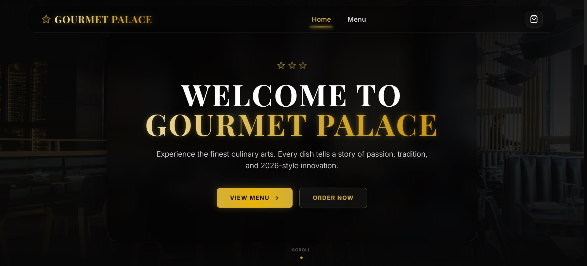
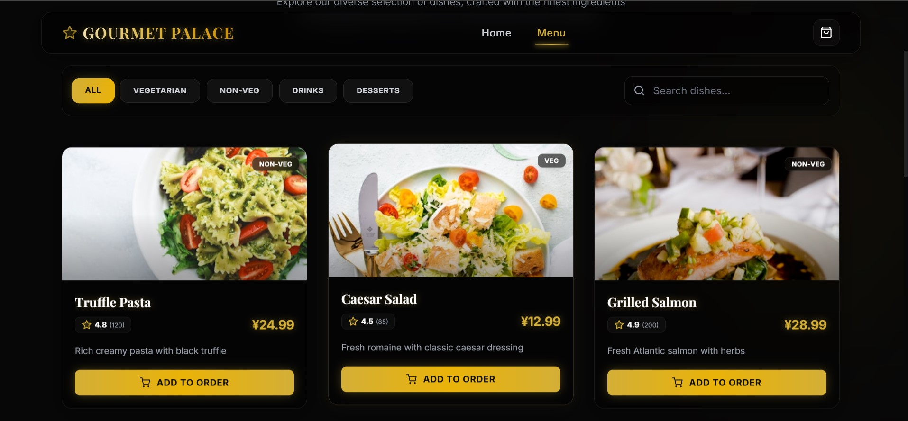

# Gourmet Palace

<div align="center">

# Premium MERN Stack Restaurant Web Application

A modern, full-stack restaurant web application built with the **MERN Stack**. It offers a premium luxury dining experience with secure authentication, responsive design, online food ordering, shopping cart functionality, and a powerful admin dashboard.

<br>


###  Live Demo

🔗 https://lnkd.in/gpu7i6Pj

</div>

---

# 📸 Screenshots

## 🏠 Home Page

<p align="center">

</p>

---

## 🍽️ Menu Page

<p align="center">

</p>

---

# ✨ Features

- 🎨 Premium Luxury Dark UI
- 📱 Fully Responsive Design
- 🔐 JWT Authentication
- 👤 User Registration & Login
- 🍽️ Restaurant Menu
- 🔍 Food Search
- 🏷️ Category Filters
- 🛒 Shopping Cart
- 📦 Order Management
- 👨‍💼 Admin Dashboard
- ✏️ CRUD Operations
- ⚡ Fast React + Vite Performance

---

# 🛠 Tech Stack

## Frontend

- React 18
- Vite
- Tailwind CSS
- Framer Motion
- Context API

---

## Backend

- Node.js
- Express.js
- MongoDB Atlas
- Mongoose
- JWT Authentication
- bcrypt

---

# 📂 Project Structure

```text
gourmet-palace
│
├── client
│   ├── public
│   ├── src
│   │   ├── assets
│   │   ├── components
│   │   ├── context
│   │   ├── hooks
│   │   ├── pages
│   │   ├── services
│   │   ├── utils
│   │   └── App.jsx
│   │
│   └── package.json
│
├── server
│   ├── config
│   ├── controllers
│   ├── middleware
│   ├── models
│   ├── routes
│   ├── utils
│   └── server.js
│
└── README.md
```

---

# 🚀 Installation

## Clone Repository

```bash
git clone https://github.com/yourusername/gourmet-palace.git

cd gourmet-palace
```

---

## Install Dependencies

```bash
npm install
```

### Client

```bash
cd client

npm install
```

### Server

```bash
cd server

npm install
```

---

# ⚙ Environment Variables

Create a `.env` file inside the **server** folder.

```env
PORT=5000

MONGO_URI=your_mongodb_connection

JWT_SECRET=your_secret_key
```

---

# ▶ Run Project

### Run Client & Server Together

```bash
npm run dev
```

### Run Separately

Backend

```bash
cd server

npm run dev
```

Frontend

```bash
cd client

npm run dev
```

---


# 🔐 Authentication

| Method | Endpoint |
|---------|----------|
| POST | /api/auth/register |
| POST | /api/auth/login |
| GET | /api/auth/me |

---

# 🍽 Menu API

| Method | Endpoint |
|---------|----------|
| GET | /api/foods |
| GET | /api/foods/:id |
| POST | /api/foods |
| PUT | /api/foods/:id |
| DELETE | /api/foods/:id |

---

# 📦 Order API

| Method | Endpoint |
|---------|----------|
| POST | /api/orders |
| GET | /api/orders/my-orders |
| GET | /api/orders/all |
| PUT | /api/orders/:id/status |

---

# 👨‍💼 Admin Dashboard

Admin can

- Add Food
- Edit Food
- Delete Food
- Manage Orders
- Update Order Status
- View Users
- Manage Restaurant Menu

---

# 🔮 Future Improvements

- 💳 Stripe Payment Gateway
- 💳 Razorpay Integration
- 📧 Email Notifications
- 🔔 Push Notifications
- ⭐ Customer Reviews
- ❤️ Wishlist
- 📍 Google Maps Integration
- ☁ Cloudinary Image Upload
- 📊 Analytics Dashboard
- 🌙 Dark / Light Mode

---

# 📱 Responsive Design

Supports

- 💻 Desktop
- 💻 Laptop
- 📱 Tablet
- 📱 Mobile

---

# 📄 License

This project is licensed under the **MIT License**.

---

# 🙌 Acknowledgements

- React
- Vite
- Express.js
- MongoDB
- Tailwind CSS
- Framer Motion

---

<div align="center">

## 👨‍💻 Developer

### Hardik 

Frontend Developer • MERN Stack Developer • Japanese Language Learner (JLPT N2)

 If you like this project, don't forget to star the repository.

</div>
